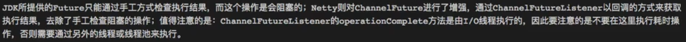

# 簡介

> io.netty.channel.ChannelFuture
> io.netty.util.concurrent.Promise

<!--more-->
# 內容

## JDK
- java.util.concurrent.Future
- java.util.concurrent.FutureTask


## netty
- io.netty.util.concurrent.Future
- io.netty.channel.ChannelFuture
```java
/**
 * <pre>
 *                                      +---------------------------+
 *                                      | Completed successfully    |
 *                                      +---------------------------+
 *                                 +---->      isDone() = true      |
 * +--------------------------+    |    |   isSuccess() = true      |
 * |        Uncompleted       |    |    +===========================+
 * +--------------------------+    |    | Completed with failure    |
 * |      isDone() = false    |    |    +---------------------------+
 * |   isSuccess() = false    |----+---->      isDone() = true      |
 * | isCancelled() = false    |    |    |       cause() = non-null  |
 * |       cause() = null     |    |    +===========================+
 * +--------------------------+    |    | Completed by cancellation |
 *                                 |    +---------------------------+
 *                                 +---->      isDone() = true      |
 *                                      | isCancelled() = true      |
 *                                      +---------------------------+
 * </pre>
*/
```




# 參考資料


